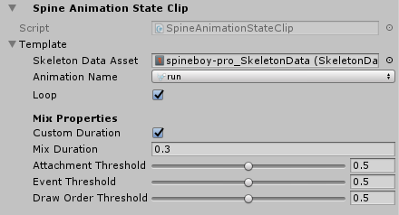

This Documentation is for the Spine Timeline features.
If this documentation contains mistakes or doesn't cover some questions, please feel to comment below, open an issue or post in the official [Spine-Unity forums](http://esotericsoftware.com/forum/viewforum.php?f=3).

# Spine-Unity Timeline Playables

## Spine Animation Track
Controls the skeleton pose a given Spine component with animations.

**Status:**
- Currently only SkeletonAnimation (via SkeletonAnimationPlayableHandle)
- Mixing has some significant bugs. It should work fine if you don't include mixing, or if all your animations have perfectly matching dopesheet properties.

**To use:**
1. Add `SkeletonAnimationPlayableHandle` component to your SkeletonAnimation GameObject.
2. With an existing Unity Playable Direction, and in the Unity Timeline window, right-click on an empty space on the left and choose **Spine.Unity.Playables** > **Spine Animation Track**.
3. Drag the SkeletonAnimation GameObject onto the empty reference property of the new Spine Skeleton Flip Track.
4. Right-click on the row in an empty space in the Timeline dopesheet and choose **Add Spine Animation Clip Clip**.
5. Adjust the start and end times of the new clip, name it appropriately at the top of the Inspector.
6. Click on the clip inspector's SkeletonDataAsset field and choose your target skeleton's SkeletonDataAsset. This will enable the animation name dropdown to appear.
7. Choose the appropriate animation name, loop, and mix settings.
8. For easier readability, rename your clip to the animation name or something descriptive. 

**Track Behavior**
- Currently buggy
- 

## Spine Skeleton Flip Track

Controls skeleton flip a given Spine component.

**Status:**
- Currently only SkeletonAnimation (via SkeletonAnimationPlayableHandle)

**To use:**
1. Add `SkeletonAnimationPlayableHandle` component to your SkeletonAnimation GameObject.
2. With an existing Unity Playable Direction, and in the Unity Timeline window, right-click on an empty space on the left and choose **Spine.Unity.Playables** > **Spine Skeleton Flip Track**.
3. Drag the SkeletonAnimation GameObject onto the empty reference property of the new Spine Skeleton Flip Track.
4. Right-click on the row in an empty space in the Timeline dopesheet and choose **Add Spine Skeleton Flip Clip Clip**.
5. Adjust the start and end times of the new clip, name it appropriately at the top of the Inspector, and choose the desired FlipX and FlipY values.

**Track Behavior**
- The specified skeleton flip values will be applied for every frame within the duration of each track.
- At the end of the timeline, the track will revert the skeleton flip to the flip values it captures when it starts playing that timeline. 

## Spine AnimationState Track

Sets Animations on the target SkeletonAnimation's AnimationState (via SetAnimation).

**Status:**
- Currently only SkeletonAnimation (directly)

**To use:**
1. With an existing Unity Playable Direction, and in the Unity Timeline window, right-click on an empty space on the left and choose **Spine.Unity.Playables** > **Spine Animation State Track**.
2. Drag the SkeletonAnimation GameObject onto the empty reference property of the new Spine AnimationState Track.
3. Right-click on the row in an empty space in the Timeline dopesheet and choose **Add Spine Animation State Clip Clip**.
4. Adjust the start and end times of the new clip, name it appropriately at the top of the Inspector.
5. Click on the clip inspector's SkeletonDataAsset field and choose your target skeleton's SkeletonDataAsset. This will enable the animation name dropdown to appear.
6. Choose the appropriate animation name, loop, and mix settings.
7. For easier readability, rename your clip to the animation name or something descriptive. 

**Track Behavior**
- `AnimationState.SetAnimation` will be called at the beginning of every clip based on the animationName.
- If a clip has no name specified, it will call SetEmptyAnimation instead.
- If the animation with the provided animationName is not found, it will do nothing (the previous animation will continue playing normally).
- Animations playing before the timeline starts playing will not be interrupted until the first clip starts playing.
- At the end of the last clip and at the end of the timeline, nothing happens. This means the effect of the last clip's SetAnimation call will persist until you give other commands to that AnimationState.
- If "custom duration" is unchecked, it will do a normal lookup of the AnimationState data's specified transition-pair mix setting, or the default mix.
- Edit mode preview mixing may look different from Play Mode mixing. Please check in actual Play Mode to see the real results.

## Known Issues
Spine Timeline support is currently experimental and has some known issues and inconveniences.
- The Console logs an incorrect/harmless error `DrivenPropertyManager has failed to register property "m_Script" of object "Spine GameObject (spineboy-pro)" with driver "" because the property doesn't exist.`. This is a known issue on Unity's end. See more here: https://forum.unity.com/threads/default-playables-text-switcher-track-error.502903/
- These Spine Tracks (like other custom Unity Timeline Playable types) do not have labels on them. Unity currently doesn't have API to specify their labels yet.
- Each track clip currently requires you to specify a reference to SkeletonData so its inspector can show you a convenient list of animation names. This is because track clips are agnostic of its track and target component/track binding, and provides no way of automatically finding it while in the editor. 
- Each track clip cannot be automatically named based on the chosen animationName. The Timeline object editors currently doesn't provide access to the clip names to do this automatically.